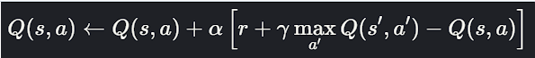

#  Áp dụng các Thuật Toán AI - Search vào Bài Toán 8-Puzzle

Dự án này triển khai các thuật toán **Tìm kiếm Trí tuệ nhân tạo (AI Search)** để giải bài toán 8-puzzle. Các nhóm thuật toán được áp dụng bao gồm:

- **Tìm kiếm không có thông tin (Uninformed Search)**
- **Tìm kiếm có thông tin (Informed Search)**
- **Tìm kiếm cục bộ (Local Search)**
- **Tìm kiếm trong môi trường phức tạp (Partial Observable & AND-OR)**
- **Bài toán ràng buộc (Constraint Satisfaction Problems - CSP)**
- **Học tăng cường (Reinforcement Learning - đang phát triển)**

Dự án có hỗ trợ hình ảnh trực quan (GIF) và biểu đồ hoạt động của các thuật toán.

# CẤU TRÚC FOLDER 
- `__pycache__/` : File cache tự động sinh bởi Python.
- `ui/` : Xây dựng giao diện đồ họa cho ứng dụng 8-puzzle.
- `Puzzle.py` : Lớp mô phỏng trạng thái của trò chơi.
- `main.py` : File chính để khởi chạy chương trình.
- `*.py` khác : Mỗi file tương ứng một thuật toán cụ thể (BFS, A*, GA, ...).

# Tổng quan về bài toán 8 puzzle
Bài toán 8 puzzle là một trò chơi trượt số trên lưới 3x3, gồm 8 ô số (từ 1 đến 8) và 1 ô trống. Mục tiêu là di chuyển các ô số từ trạng thái ban đầu đến trạng thái mục tiêu (thường là 1-2-3, 4-5-6, 7-8-trống) bằng cách trượt ô trống lên, xuống, trái, hoặc phải.

# Không gian trạng thái 
- **Tổng trạng thái**: `9! = 362,880`
- **Số trạng thái hợp lệ**: `181,440` (do ràng buộc tính chẵn lẻ hoán vị)
- **Mỗi trạng thái có tối đa**: 4 hành động (move blank)
- **Độ sâu tối đa**: 31 bước (trường hợp tệ nhất)

# Độ phức tạp 
Thời gian cần thiết để các thuật toán tìm kiếm giải bài toán có thể khác nhau đáng kể. Đối với các thuật toán tìm kiếm mù (không sử dụng thông tin heuristic), độ phức tạp thời gian có thể lên đến O(b^d), với b là hệ số rẽ nhánh (số lượng các trạng thái con có thể từ một trạng thái) và d là độ sâu của cây tìm kiếm. Ngược lại, các thuật toán heuristic tối ưu có thể đạt độ phức tạp thời gian tốt hơn, chẳng hạn như O(n).
Tương tự, yêu cầu về bộ nhớ (độ phức tạp không gian) cũng thay đổi. Các thuật toán tiết kiệm bộ nhớ chỉ cần O(d) bộ nhớ, trong khi các thuật toán lưu trữ toàn bộ các trạng thái đã xét có thể cần tới O(b^d) bộ nhớ.

# Tính chất
- **Tĩnh**: Trạng thái không thay đổi khi tìm kiếm.
- **Xác định**: Mỗi hành động luôn cho kết quả duy nhất.
- **Rời rạc**: Trạng thái và hành động là hữu hạn.
- **Khả thi có hạn**: Chỉ một nửa tổng trạng thái là giải được (do tính chẵn lẻ).

# Tìm kiếm không có thông tin (Uninformed Search)
Uninformed Search bao gồm các thuật toán như BFS, DFS, UCS, và IDS. Dưới đây là các hình ảnh trực quan cho từng thuật toán, cùng với biểu đồ hiệu suất.

### Hình ảnh Trực quan

| Tên thuật toán | Hình ảnh                   |
| -------------- | -------------------------- |
| BFS            |      |
| DFS            |      |
| UCS            |      |
| IDS            |      |

### Biểu đồ Hiệu suất

### Phân tích

Uninformed Search là nhóm thuật toán tìm kiếm mù, tức không có sử dụng bất cứ thông tin đường đi nào khác ngoài cấu hình không gian trạng thái (cấu hình board) và tập hành động. Điều đó làm cho các thuật toán trong nhóm này phải duyệt qua toàn bộ không gian trạng thái (mở rộng tập tìm kiếm liên tục), thường đảm bảo tìm được giải pháp nếu tồn tại nhưng không chắc là giải pháp tối ưu nhất. Đặc biệt gặp vấn đề về hiệu suất trong không gian trạng thái 9! của bài toán 8 puzzle. Trong đó:

- `BFS`: Là thuật toán tìm kiếm theo chiều rộng, luôn đảm bảo tìm ra lời giải ngắn nhất (tối ưu về số bước di chuyển). BFS đặc biệt hiệu quả trong các bài toán có lời giải ở độ sâu thấp. Tuy nhiên, do phải lưu trữ toàn bộ các trạng thái cùng mức, không gian trạng thái sẽ tăng rất nhanh khi độ sâu tăng, dẫn đến tốn nhiều bộ nhớ và thời gian hơn trong các bài toán có lời giải sâu..
- `DFS`: Tìm theo chiều sâu, nên tiết kiệm bộ nhớ hơn BFS vì chỉ cần lưu trạng thái của nhánh hiện tại. Trong một số trường hợp, DFS có thể tìm ra lời giải nhanh hơn nếu lời giải nằm ở nhánh sâu. Tuy nhiên, DFS không đảm bảo tìm ra lời giải ngắn nhất, và rất dễ bị rơi vào các nhánh vô vọng hoặc lặp lại, đặc biệt nếu không giới hạn độ sâu.
- `IDDFS`:Là sự kết hợp giữa BFS và DFS: tìm kiếm theo chiều sâu nhưng có giới hạn và tăng dần giới hạn độ sâu qua từng vòng lặp. IDDFS đảm bảo tìm được lời giải tối ưu (giống BFS) trong khi vẫn tiết kiệm bộ nhớ như DFS. Nhược điểm của IDDFS là phải lặp lại quá trình tìm kiếm ở mỗi mức độ sâu, dẫn đến tăng thời gian tính toán
- `UCS`: Mở rộng các trạng thái theo chi phí tích lũy từ trạng thái ban đầu. Với bài toán 8-puzzle mà mọi bước di chuyển đều có cùng chi phí, UCS sẽ hoạt động giống hệt như BFS, và do đó vẫn đảm bảo lời giải tối ưu. Tuy nhiên, nếu áp dụng chi phí khác nhau cho từng bước (ví dụ chi phí theo trọng số), UCS mới thực sự phát huy lợi thế.
## Tìm kiếm Có Thông Tin (Informed Search)

Tìm kiếm Có Thông Tin bao gồm các thuật toán như A\*, Tìm kiếm Tốt Nhất Trước Hết theo Heuristic, và một phương pháp dựa trên heuristic khác. Dưới đây là các hình ảnh trực quan và biểu đồ hiệu suất.

### Hình ảnh Trực quan

| Tên thuật toán | Hình ảnh                    |
| -------------- | ----------------------------|
| A\*            |    |
| IDA\*          |       |
| GRE            |       |

### Biểu đồ Time(ms) và Steps

### Phân tích

Informed Search là nhóm thuật toán sử dụng thông tin heuristic để ưu tiên duyệt các trạng thái được cho là có "triển vọng". Heuristic được dùng ở đây là tổng khoảng cách Manhattan của các ô so với vị trí đúng. Nhóm thuật toán này thể hiện khả năng giảm đáng kể số trạng thái cần duyệt so với Uninformed Search. Trong đó:

- `A*`: Kết hợp chi phí thực tế g(n) và ước lượng h(n) để tìm đường đi ngắn nhất. Với heuristic admissible, A* đảm bảo giải pháp tối ưu. Tuy nhiên, tiêu tốn nhiều bộ nhớ do phải lưu toàn bộ trạng thái đã xét và hàng đợi ưu tiên, hiệu suất giảm nếu lời giải ở sâu.
- `IDA*`: Sử dụng duyệt sâu dần theo ngưỡng f(n) nên tiết kiệm bộ nhớ hơn. Tuy nhiên, do phải lặp lại duyệt nhiều lần, thời gian xử lý cao hơn A* trong một số trường hợp.
- `Greedy Best-First Search`: Chỉ xét heuristic h(n), tìm lời giải nhanh nhưng không đảm bảo tối ưu. Dễ rơi vào nhánh sai nếu heuristic không chính xác. Phù hợp khi cần tốc độ thay vì chất lượng giải pháp.

## Tìm kiếm Cục Bộ (Local Search)

Tìm kiếm Cục Bộ bao gồm các thuật toán như Leo Đồi (Hill Climbing), Ủ Nhiệt Mô Phỏng (Simulated Annealing), Thuật toán Di truyền (Genetic Algorithms), và các thuật toán khác. Dưới đây là các hình ảnh trực quan và biểu đồ hiệu suất.

### Hình ảnh Trực quan

| Tên thuật toán          | Hình ảnh                      |
| ----------------------- | ----------------------------- |
| HillClimbing(Simple)    |       |
| HillClimbing(Steepest)  |       |
| HillClimbing(Stochatic) |       |
| Beam Search             |       |
| Simulated Annealing     |   |
| Genetic Algorithm       |           |

### Biểu đồ Time(ms) và Steps

### Phân tích

Local Search không duyệt toàn bộ không gian trạng thái vì vậy độ phức tạp không gian giảm mạnh so với hai thuật toán trước, chỉ tập trung cải thiện lời giải cục bộ và hiệu quả với không gian trạng thái quá lớn. Tuy nhiên vấn đề của nhóm này chính là lời giải thường không tối ưu toàn cục và dễ bị mắc kẹt ở cực trị cục bộ. Trong đó:

- `SA`:Có khả năng vượt qua cực trị cục bộ nhờ cơ chế làm nguội và chấp nhận bước đi xấu tạm thời. Tuy nhiên, hiệu quả kém với 8-puzzle, đặc biệt khi lời giải sâu, do dễ dừng ở trạng thái không tối ưu.
- `GA`: Tìm kiếm đa hướng, khai thác quần thể để tăng xác suất tìm lời giải. Tuy nhiên, phụ thuộc mạnh vào tham số, dễ mất nhiều thời gian để hội tụ, và kết quả không luôn tối ưu.
- `Beam`: Mở rộng giới hạn các nhánh tốt nhất (theo heuristic). Giữ beam_width trạng thái có tiềm năng cao nhất. Hiệu quả khi lựa chọn beam_width phù hợp, nhưng vẫn có thể bỏ sót lời giải tối ưu nếu không nằm trong beam tại một thời điểm.
  `SA`: Thuật toán mô phỏng quá trình làm nguội vật lý, cho phép chấp nhận bước đi kém hơn trong giai đoạn đầu để thoát khỏi cực trị cục bộ. Nhiệt độ giảm dần giúp thuật toán ngày càng khắt khe trong lựa chọn. Tuy nhiên, với 8-puzzle, SA thường chậm hội tụ, dễ đi lòng vòng nếu không điều chỉnh tốt tốc độ làm nguội (cooling_rate) và số bước (max_steps). Vì vậy, hiệu quả kém hơn so với các thuật toán có định hướng rõ ràng như A*.

## Tìm kiếm Phức Tạp (Complex Environments)

Tìm kiếm Phức Tạp bao gồm ba thuật toán nâng cao cùng với các hình ảnh trực quan và biểu đồ hiệu suất.

### Hình ảnh Trực quan

| Tên thuật toán          | Hình ảnh                             |
| ----------------------- | ------------------------------       |
| Search with no obs      |        |
| Search with partial obs |         |
| And or search           |       |

### Biểu đồ Time(ms) và Steps

### Phân tích

Search in Complex Environment là nhóm thuật toán xử lý các điều kiện thực tế như môi trường mù hoàn toàn hay môi trường có thông tin một phần. 8 puzzle là bài toán tĩnh, ít phù hợp hơn với nhóm này. Tuy nhiên chúng ta cũng có thể cài đặt một số biến thể để xem xét cách hoạt động. Trong đó:

- `Search with no observation`: Thuật toán hoạt động khi agent không biết gì về trạng thái hiện tại, kể cả vị trí. Bạn đã mô phỏng bằng cách thiết lập belief state là tập tất cả các trạng thái có thể, và sử dụng BFS để tìm kiếm lời giải thỏa mãn mọi trạng thái trong tập tin tưởng đều là goal. Dễ hiểu nhưng không hiệu quả khi không gian trạng thái quá lớn.
- `Search with partial observation`: Đã rút gọn không gian belief state bằng cách gán trước thông tin 1 nằm ở (0,0). Điều này giúp thu hẹp đáng kể số trạng thái cần xét, nhờ đó thuật toán tìm lời giải nhanh và chính xác hơn. Đây là một cải tiến thiết thực trong điều kiện quan sát không đầy đủ.
- `And Or Search`: Nút OR (chọn hành động) và nút AND (phải thỏa tất cả hệ quả). Dù thuật toán phù hợp với các bài toán có kết quả không chắc chắn. Kết quả chạy chủ yếu để mô phỏng nguyên lý, không tối ưu về hiệu năng.

## Bài toán Hài Hòa Ràng Buộc (CSPs)

CSPs bao gồm các thuật toán như Quay lui (Backtracking). Dưới đây là các hình ảnh trực quan.
### Hình ảnh Trực quan

| Tên thuật toán             | Hình ảnh                              |
| -------------------------- | ------------------------------------- |
| Backtracking (simple)      |  |

### Biểu đồ Time(ms) và Steps

### Phân tích

CSPs là nhóm thuật toán dựa trên việc giải quyết ràng buộc giữa các biến.

- `Backtracking`: tự điền từng số từ 0 đến 8 vào ma trận 3x3 và kiểm tra trạng thái goal sau mỗi lần điền đủ. Dù luôn tìm được lời giải, nhưng vì không áp dụng giới hạn hoặc thứ tự hợp lý, nên hiệu suất rất kém, thời gian chạy lâu và duyệt rất nhiều trạng thái dư thừa..

---

## Bảng So sánh Các Thuật Toán

| Thuật toán                 | Độ phức tạp thời gian | Độ phức tạp không gian | Hoàn thiện | Tối ưu |
| -------------------------- | --------------------- | ---------------------- | ---------- | ------ |
| BFS                        | \(O(b^d)\)            | \(O(b^d)\)             | Có         | Có     |
| DFS                        | \(O(b^m)\)            | \(O(bm)\)              | Không      | Không  |
| UCS                        | \(O(b^d)\)            | \(O(b^d)\)             | Có         | Có     |
| IDDFS                      | \(O(b^d)\)            | \(O(bd)\)              | Có         | Có     |
| A\*                        | \(O(b^d)\)            | \(O(b^d)\)             | Có         | Có     |
| IDA\*                      | \(O(b^d)\)            | \(O(bd)\)              | Có         | Có     |
| GBFS                       | \(O(b^m)\)            | \(O(bm)\)              | Không      | Không  |
| Hill Climbing (Simple)     | \(O(\infty)\)         | \(O(1)\)               | Không      | Không  |
| Simulated Annealing        | \(O(\infty)\)         | \(O(1)\)               | Không      | Không  |
| Genetic Algorithm          | \(O(g \cdot p)\)      | \(O(p)\)               | Không      | Không  |
| Beam Search                | \(O(w . d)\)          | \(O(w)\)               | Không      | Không  |
| Search with no obs         | \(O(b^d)\)            | \(O(b^d)\)             | Có         | Không  |
| Search with partial obs    | \(O(b^d)\)            | \(O(b^d)\)             | Có         | Không  |
| And Or Search              | \(O(b^m)\)            | \(O(bm)\)              | Có         | Không  |
| Backtracking (Simple)      | \(O(n!)\)             | \(O(n)\)               | Có         | Có     |

- \(b\): Độ nhánh, \(d\): Độ sâu lời giải, \(m\): Độ sâu tối đa, \(g\): Số thế hệ, \(p\): Kích thước quần thể, \(n\): Số biến, \(d\): độ sâu của lời giải (số bước từ gốc đến đích, \(w\): beam width (số lượng node giữ lại tại mỗi mức)

---

## Học Tăng Cường

Học Tăng Cường (Reinforcement Learning - RL) áp dụng agent học qua thử nghiệm và phần thưởng.

### Hình ảnh Trực quan

| Tên thuật toán | Hình ảnh                            |
| -------------- | ----------------------------------- |
| Q-Learning     |  |

### Phân tích

RL huấn luyện agent qua phần thưởng, phù hợp với bài toán động hơn 8 puzzle tĩnh, cập nhật Q theo công thức:

- `Q-Learning`: Học bảng Q qua thử nghiệm, hiệu quả với không gian nhỏ. Với 8 puzzle, tốc độ học chậm do không gian trạng thái lớn (181,440 trạng thái khả thi), cần nhiều lần lặp. Không đảm bảo tối ưu như A\*, nhưng linh hoạt với môi trường thay đổi. Biểu đồ ở trên nêu lên so sánh trực quan về Q-learning-first với 2000 episode ban đầu và Q-learning nâng cao hơn với việc tăng số episode lên 50000, tăng epsilon cho khả năng khám phá ban đầu tốt hơn,... và đã mang lại hiệu suất tốt hơn hẳn. Tuy nhiên vẫn có thể cải thiện thêm.
