# ÁP DỤNG CÁC THUẬT TOÁN AI - SEARCH VÀO 8-PLUZZLE
Dự án này triển khai các thuật toán tìm kiếm Trí tuệ nhân tạo để giải bài toán 8 puzzle. Các thuật toán bao gồm: Tìm kiếm không có thông tin, Tìm kiếm có thông tin, Tìm kiếm cục bộ, Tìm kiếm trong môi trường phức tạp, Bài toán ràng buộc (CSPs) và Học tăng cường (đang phát triển). Dự án cung cấp hình ảnh trực quan (GIF) và biểu đồ hiệu suất để minh họa hoạt động của các thuật toán trong môi trường tĩnh và xác định của bài toán 8 puzzle.
# CẤU TRÚC FOLDER 
__pycache__: Thư mục chứa các file bộ nhớ đệm của Python (tự động tạo).
**ui**: Xây dựng giao diện đồ họa cho ứng dụng giải bài toán 8 puzzle.
**Puzzle**: Mô phỏng một trạng thái của trò chơi.
**main**: Để khởi chạy trò chơi
**Còn lại là các file chứa các code của từng thuật toán**

# Tổng quan về bài toán 8 puzzle
Bài toán 8 puzzle là một trò chơi trượt số trên lưới 3x3, gồm 8 ô số (từ 1 đến 8) và 1 ô trống. Mục tiêu là di chuyển các ô số từ trạng thái ban đầu đến trạng thái mục tiêu (thường là 1-2-3, 4-5-6, 7-8-trống) bằng cách trượt ô trống lên, xuống, trái, hoặc phải.

# Không gian trạng thái 
Tổng số hoán vị có thể có của 9 ô là 9! = 362,880 trạng thái. Tuy nhiên, chỉ có một nửa trong số đó là có thể giải được (gọi là trạng thái hợp lệ hay có thể đạt được). Số không hợp lệ là do vi phạm vị trí tính chất chẵn lẻ của hoán vị.
Mỗi trạng thái có tối đa 4 hành động (di chuyển ô trống), dẫn đến một đồ thị trạng thái với độ sâu tối đa khoảng 31 bước trong trường hợp xấu nhất.

# Độ phức tạp 
Thời gian cần thiết để các thuật toán tìm kiếm giải bài toán có thể khác nhau đáng kể. Đối với các thuật toán tìm kiếm mù (không sử dụng thông tin heuristic), độ phức tạp thời gian có thể lên đến O(b^d), với b là hệ số rẽ nhánh (số lượng các trạng thái con có thể từ một trạng thái) và d là độ sâu của cây tìm kiếm. Ngược lại, các thuật toán heuristic tối ưu có thể đạt độ phức tạp thời gian tốt hơn, chẳng hạn như O(n).
Tương tự, yêu cầu về bộ nhớ (độ phức tạp không gian) cũng thay đổi. Các thuật toán tiết kiệm bộ nhớ chỉ cần O(d) bộ nhớ, trong khi các thuật toán lưu trữ toàn bộ các trạng thái đã xét có thể cần tới O(b^d) bộ nhớ.

# Tính chất
Tĩnh: Trạng thái của bài toán không thay đổi trong khi tìm kiếm giải pháp.
Xác định: Mỗi hành động (di chuyển ô trống) luôn cho một kết quả duy nhất.
Rời rạc: Số lượng trạng thái và hành động có thể là hữu hạn.
Tính khả thi có hạn: Không phải mọi trạng thái ban đầu đều có thể biến đổi thành mọi trạng thái đích; điều này phụ thuộc vào tính chẵn lẻ của các hoán vị trong bàn cờ.

# Tìm kiếm không có thông tin (Uninformed Search)
Uninformed Search bao gồm các thuật toán như BFS, DFS, UCS, và IDS. Dưới đây là các hình ảnh trực quan cho từng thuật toán, cùng với biểu đồ hiệu suất.

### Hình ảnh Trực quan

| Tên thuật toán | Hình ảnh                   |
| -------------- | -------------------------- |
| BFS            | 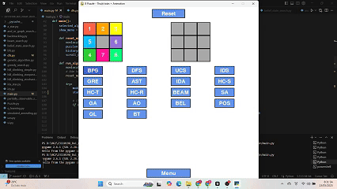     |
| DFS            | 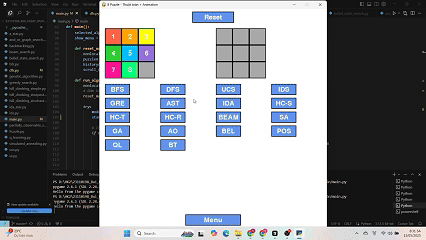     |
| UCS            | 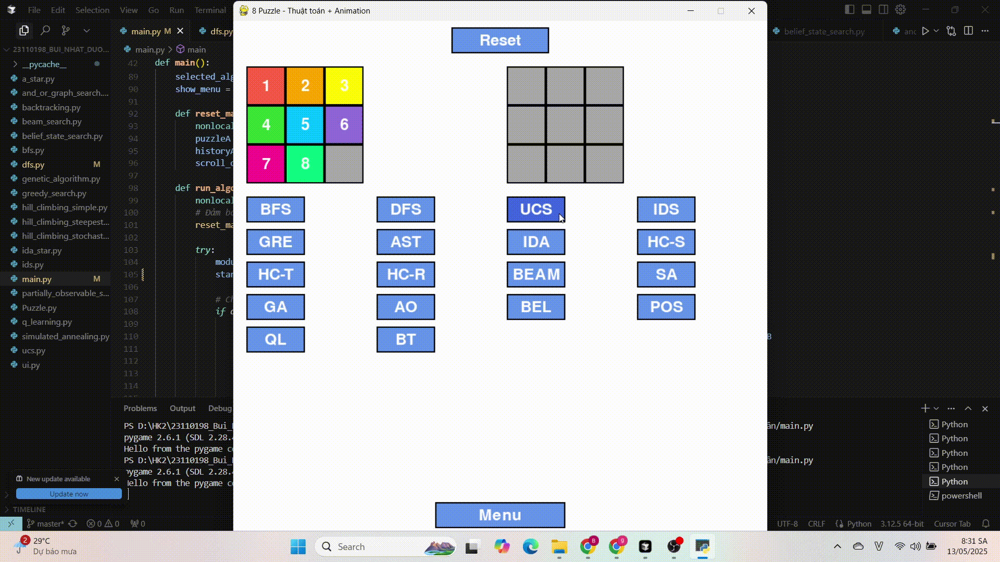     |
| IDS            |      |

### Biểu đồ Hiệu suất

### Phân tích

Uninformed Search là nhóm thuật toán tìm kiếm mù, tức không có sử dụng bất cứ thông tin đường đi nào khác ngoài cấu hình không gian trạng thái (cấu hình board) và tập hành động. Điều đó làm cho các thuật toán trong nhóm này phải duyệt qua toàn bộ không gian trạng thái (mở rộng tập tìm kiếm liên tục), thường đảm bảo tìm được giải pháp nếu tồn tại nhưng không chắc là giải pháp tối ưu nhất. Đặc biệt gặp vấn đề về hiệu suất trong không gian trạng thái 9! của bài toán 8 puzzle. Trong đó:

- `BFS`: luôn tìm được lời giải ngắn nhất, hiệu quả với bài toán độ sâu thấp như trên ảnh gif ví dụ. Tuy nhiên không gian trạng thái tìm kiếm tương đối lớn và gặp khó khăn khi lời giải quá sâu.
- `DFS`: tiết kiệm bộ nhớ hơn BFS do chỉ lưu trữ trạng thái của nhánh đang xét, đồng thời tìm được lời giải nhanh hơn BFS cho các nhánh sâu. Tuy nhiên thường không tìm ra được giải pháp tối ưu và phức tạp thời gian tăng cao nếu khám phá nhánh ở xa lời giải.
- `IDDFS`: kết hợp ưu điểm tìm lời giải tối ưu và tiết kiệm bộ nhớ của BFS và DFS. Phù hợp với bài toán 8 puzzle có độ sâu trong khoảng 15-25 bước. Tuy nhiên do lặp lại duyệt trên từng độ sâu liên tục nên hiệu suất bị giảm.
- `UCS`: sử dụng chi phí tích lũy từ trạng thái ban đầu để quyết định mở rộng trạng thái nào tiếp theo. Nhưng ở bài toán 8 puzzle khi chi phí các bước đi đều bằng nhau thì UCS sẽ cho kết quả tương tự BFS.

## Tìm kiếm Có Thông Tin (Informed Search)

Tìm kiếm Có Thông Tin bao gồm các thuật toán như A\*, Tìm kiếm Tốt Nhất Trước Hết theo Heuristic, và một phương pháp dựa trên heuristic khác. Dưới đây là các hình ảnh trực quan và biểu đồ hiệu suất.

### Hình ảnh Trực quan

| Tên thuật toán | Hình ảnh                    |
| -------------- | ----------------------------|
| A\*            |    |
| IDA\*          | 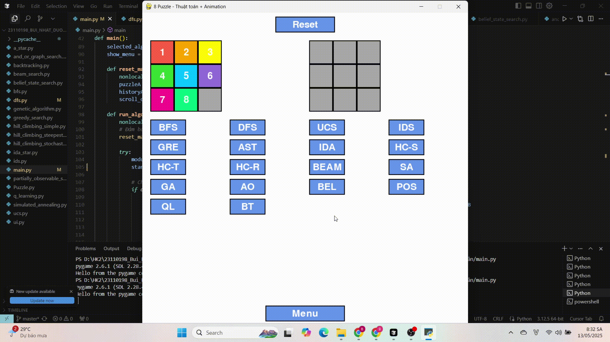      |
| GRE            | 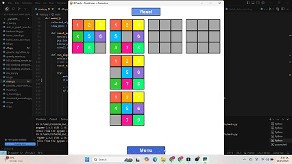      |

### Biểu đồ Hiệu suất

### Phân tích

Informed Search là nhóm thuật toán sử dụng thông tin heuristic để ưu tiên duyệt các trạng thái được cho là có "triển vọng". Heuristic được dùng ở đây là tổng khoảng cách Manhattan của các ô so với vị trí đúng. Nhóm thuật toán này thể hiện khả năng giảm đáng kể số trạng thái cần duyệt so với Uninformed Search. Trong đó:

- `A*`: với heuristic admissible (không vượt quá chi phí thực tế), A\* đảm bảo tìm được giải pháp tối ưu trong bài toán 8 puzzle với thời gian nhanh nhất. Tuy nhiên thuật toán cũng gặp vấn đề về không gian bộ nhớ do yêu cầu lưu toàn bộ trạng thái đã duyệt cùng với đó là giảm hiệu suất khi lời giải ở sâu.
- `IDA*`: Sử dụng ít bộ nhớ hơn A\* nhờ vào cơ chế duyệt sâu dần. Tuy nhiên tốn thời gian hơn vì phải duyệt lại nhiều lần nếu trạng thái ở sâu.
- `Greedy Best-First Search`: Nhanh hơn A\* vì chỉ tập trung vào giá trị heuristic h(n). Đặc biệt tốt khi cần lời giải nhanh và nhất thiết tối ưu. Và điểm yếu cũng là không đảm bảo tìm được lời giải tối ưu nhất.

## Tìm kiếm Cục Bộ (Local Search)

Tìm kiếm Cục Bộ bao gồm các thuật toán như Leo Đồi (Hill Climbing), Ủ Nhiệt Mô Phỏng (Simulated Annealing), Thuật toán Di truyền (Genetic Algorithms), và các thuật toán khác. Dưới đây là các hình ảnh trực quan và biểu đồ hiệu suất.

### Hình ảnh Trực quan

| Tên thuật toán          | Hình ảnh                      |
| ----------------------- | ----------------------------- |
| HillClimbing(Simple)    | 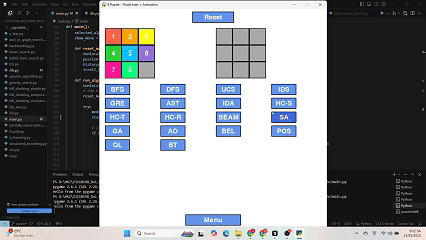      |
| HillClimbing(Steepest)  |       |
| HillClimbing(Stochatic) | 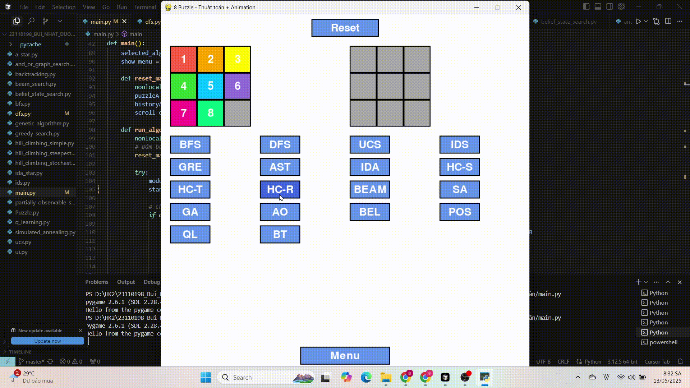      |
| Beam Search             |       |
| Simulated Annealing     | 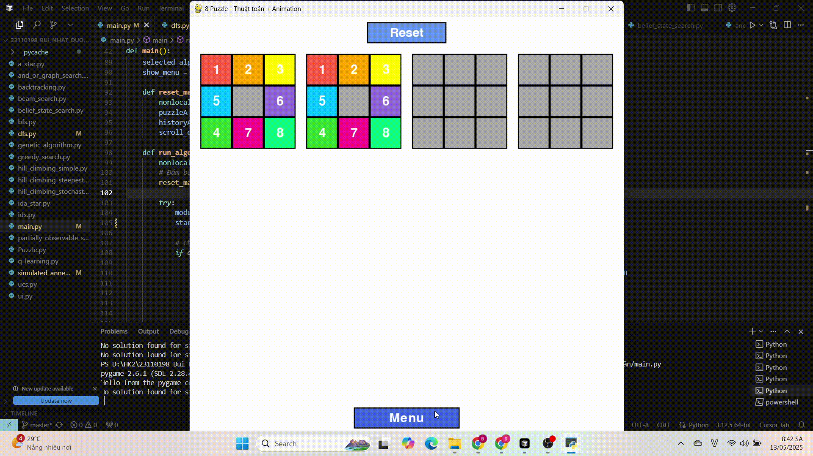  |
| Genetic Algorithm       |           |

### Biểu đồ Hiệu suất

### Phân tích

Local Search không duyệt toàn bộ không gian trạng thái vì vậy độ phức tạp không gian giảm mạnh so với hai thuật toán trước, chỉ tập trung cải thiện lời giải cục bộ và hiệu quả với không gian trạng thái quá lớn. Tuy nhiên vấn đề của nhóm này chính là lời giải thường không tối ưu toàn cục và dễ bị mắc kẹt ở cực trị cục bộ. Trong đó:

- `SA`: Có khả năng vượt qua cực trị cục bộ bằng việc "làm nguội" và chọn các ước đi tạm thời kém hơn. Tuy nhiên hiện đang là thuật toán kém hiệu quả nhất với 8 puzzle, đặc biệt khi lời giải ở độ sâu cao.
- `GA`: Thử nghiệm nhiều trạng thái cùng lúc, tăng khả năng tìm ra lời giải. Tuy nhiên mất nhiều thời gian trong việc thử nghiệm và tối ưu tham số. Ngoài ra thời gian hội tụ của thuật toán cũng có thể rất lâu.
- `Nhóm thuật toán HillClimbing`: Nhanh và dễ triển khai. HillClimbing cơ bản dễ bị mắc kẹt ở cực trị địa phương. HillClimbing Steepest xem xét các trạng thái lân cân và tìm trạng thái tốt nhất tuy nhiên cũng dễ mắc kẹt trong bẫy cực trị cục bộ. HillClimbing Storchastic đem lại một tỉ lệ chọn các trạng thái không tốt bằng để tránh bẫy cực trị tuy nhiên đòi hỏi việc điều chỉnh tỉ lệ phù hợp. Vấn đề chung của nhóm trên là dù nhanh nhưng rất dễ bị mắc kẹt.

## Tìm kiếm Phức Tạp (Complex Environments)

Tìm kiếm Phức Tạp bao gồm ba thuật toán nâng cao cùng với các hình ảnh trực quan và biểu đồ hiệu suất.

### Hình ảnh Trực quan

| Tên thuật toán          | Hình ảnh                             |
| ----------------------- | ------------------------------       |
| Search with no obs      |        |
| Search with partial obs | 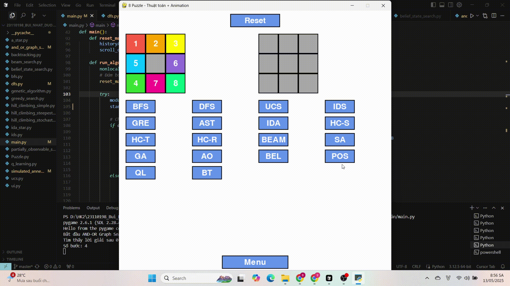        |
| And or search           | 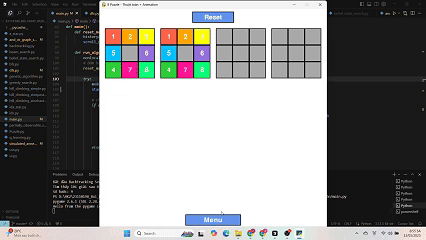      |

### Biểu đồ Hiệu suất

### Phân tích

Search in Complex Environment là nhóm thuật toán xử lý các điều kiện thực tế như môi trường mù hoàn toàn hay môi trường có thông tin một phần. 8 puzzle là bài toán tĩnh, ít phù hợp hơn với nhóm này. Tuy nhiên chúng ta cũng có thể cài đặt một số biến thể để xem xét cách hoạt động. Trong đó:

- `Search with no observation`: giả định môi trường khi agent không có bất kỳ thông tin gì, ngay cả vị trí của bản thân. Thực hiện cài đặt belief states ban đầu và tìm kiếm theo BFS về tập goal states.
- `Search with partial observation`: tương tự như thuật toán trên nhưng có được thêm một phần thông tin về môi trường. Ở đây là thông tin số 1 nằm ở tọa độ (0,0), giúp giảm đáng kể không gian trạng thái cần xét.
- `And Or Search`: Được sử dụng trong bài toán có nhiều nhánh lựa chọn và các tình huống không xác định. Nút Or đại diện cho các lựa chọn khác nhau mà agent có thể thực hiện, nút And đại diện cho điều kiện con phải đượ thỏa để đạt mục tiêu. Phù hợp cho bài toán lên kế hoạch phức tạp, tuy nhiên 8 puzzle là không gian tĩnh nên thuật toán không thể hiện được nhiều.

## Bài toán Hài Hòa Ràng Buộc (CSPs)

CSPs bao gồm các thuật toán như Quay lui (Backtracking), Kiểm tra Tính Hài Hòa Cung (Arc Consistency), và một phương pháp CSP khác. Dưới đây là các hình ảnh trực quan và biểu đồ hiệu suất.

### Hình ảnh Trực quan

| Tên thuật toán             | Hình ảnh                              |
| -------------------------- | ------------------------------------- |
| Backtracking (simple)      | 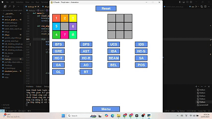 |

### Biểu đồ Hiệu suất

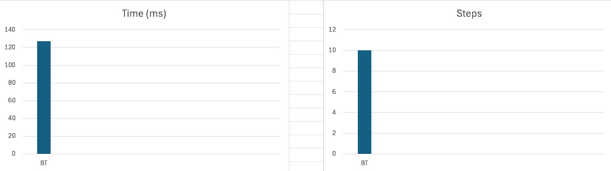

### Phân tích

CSPs là nhóm thuật toán dựa trên việc giải quyết ràng buộc giữa các biến. Ta biến đổi bài toán giải 8 puzzle thành dạng bài tô màu đồ thị với các ràng buộc để cài đặt nhóm thuật toán này. Trong đó:

- `Nhóm thuật toán Backtracking`: backtracking ngây thơ đạt hiệu quả rất tệ với 8 puzzle, mất rất nhiều thời gian tuy nhiên sẽ đảm bảo luôn tìm ra lời giải. Backtracking với contraints (ràng buộc) cho hiệu quả tốt hơn hẳn với ràng buộc các số tăng dần theo thứ tự ô. Trong khi Backtracking với lcv kết hợp contraints thì chưa đạt được hiệu quả cải tiến quá nhiều.

---

## Bảng So sánh Các Thuật Toán

| Thuật toán                 | Độ phức tạp thời gian | Độ phức tạp không gian | Hoàn thiện | Tối ưu |
| -------------------------- | --------------------- | ---------------------- | ---------- | ------ |
| BFS                        | \(O(b^d)\)            | \(O(b^d)\)             | Có         | Có     |
| DFS                        | \(O(b^m)\)            | \(O(bm)\)              | Không      | Không  |
| UCS                        | \(O(b^d)\)            | \(O(b^d)\)             | Có         | Có     |
| IDDFS                      | \(O(b^d)\)            | \(O(bd)\)              | Có         | Có     |
| A\*                        | \(O(b^d)\)            | \(O(b^d)\)             | Có         | Có     |
| IDA\*                      | \(O(b^d)\)            | \(O(bd)\)              | Có         | Có     |
| GBFS                       | \(O(b^m)\)            | \(O(bm)\)              | Không      | Không  |
| Hill Climbing (Simple)     | \(O(\infty)\)         | \(O(1)\)               | Không      | Không  |
| Simulated Annealing        | \(O(\infty)\)         | \(O(1)\)               | Không      | Không  |
| Genetic Algorithm          | \(O(g \cdot p)\)      | \(O(p)\)               | Không      | Không  |
| Search with no obs         | \(O(b^d)\)            | \(O(b^d)\)             | Có         | Không  |
| Search with partial obs    | \(O(b^d)\)            | \(O(b^d)\)             | Có         | Không  |
| And Or Search              | \(O(b^m)\)            | \(O(bm)\)              | Có         | Không  |
| Backtracking (Simple)      | \(O(n!)\)             | \(O(n)\)               | Có         | Có     |

- \(b\): Độ nhánh, \(d\): Độ sâu lời giải, \(m\): Độ sâu tối đa, \(g\): Số thế hệ, \(p\): Kích thước quần thể, \(n\): Số biến.

---

## Học Tăng Cường

Học Tăng Cường (Reinforcement Learning - RL) áp dụng agent học qua thử nghiệm và phần thưởng.

### Hình ảnh Trực quan

| Tên thuật toán | Hình ảnh                            |
| -------------- | ----------------------------------- |
| Q-Learning     | 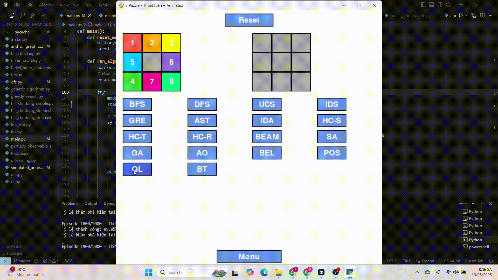 |

### Phân tích

RL huấn luyện agent qua phần thưởng, phù hợp với bài toán động hơn 8 puzzle tĩnh, cập nhật Q theo công thức:

- `Q-Learning`: Học bảng Q qua thử nghiệm, hiệu quả với không gian nhỏ. Với 8 puzzle, tốc độ học chậm do không gian trạng thái lớn (181,440 trạng thái khả thi), cần nhiều lần lặp. Không đảm bảo tối ưu như A\*, nhưng linh hoạt với môi trường thay đổi. Biểu đồ ở trên nêu lên so sánh trực quan về Q-learning-first với 2000 episode ban đầu và Q-learning nâng cao hơn với việc tăng số episode lên 50000, tăng epsilon cho khả năng khám phá ban đầu tốt hơn,... và đã mang lại hiệu suất tốt hơn hẳn. Tuy nhiên vẫn có thể cải thiện thêm.
